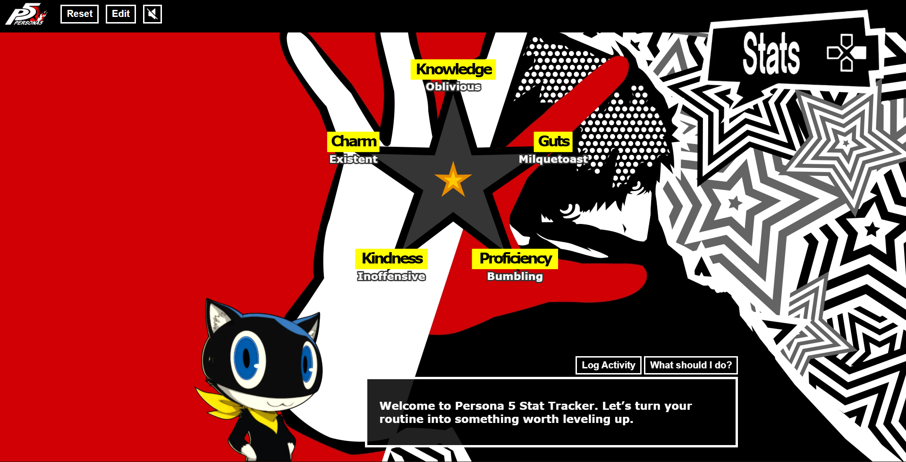
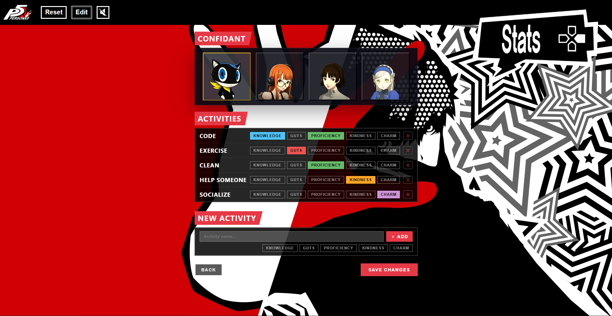

# Persona 5 Stat Tracker

A Persona 5-inspired stat tracker built with React and Vite. Users can manage character stats, choose activities that raise traits like Knowledge, Guts, Proficiency, Kindness, and Charm, edit the available activities to suit their lifestyle, and switch between confidants for a different in-app companion experience.

### Main Tracker Page



### Edit Activities Page



## Live Demo

https://persona5stats.netlify.app/

## Project Description

The app displays a visual stat tracker on the main page and lets users select activities that increment trait values. Stats are persisted in `localStorage`, so progress remains after refreshing the browser. The app also includes a confidant selection feature that changes the companion character, dialogue, and visual presentation, alongside an edit page for customizing activity names and trait effects.

## Technologies Used

- React 19
- Vite
- React Router DOM
- Recharts
- CSS
- Browser `localStorage`

## Setup and Installation

1. Clone the repository:
   ```bash
   git clone https://github.com/your-username/persona5_stat_tracker_2026.git
   cd persona5_stat_tracker_2026
   ```
2. Install dependencies:
   ```bash
   npm install
   ```
3. Run the development server:
   ```bash
   npm run dev
   ```
4. Open the app in your browser at the URL shown in the terminal, typically `http://localhost:5173`.

### Build and Preview

- Build for production:
  ```bash
  npm run build
  ```
- Preview the production build locally:
  ```bash
  npm run preview
  ```

## Pages and Features

- **Main Tracker Page**
  - Displays character stats in a Persona 5-inspired UI.
  - Lets users pick activities to improve trait values.
  - Shows visual feedback for level-ups and maxed traits.
- **Edit Page**
  - Supports choosing a confidant to change the companion character and style.
  - Customize activity names.
  - Toggle which traits each activity affects.
  - Add or remove activities.
  - Reset the activity list to default values.
  - Change the selected confidant from the same flow.
- **Header Controls**
  - Includes reset actions that are tailored to the current page.
  - Offers a mute/unmute toggle for the background audio.
